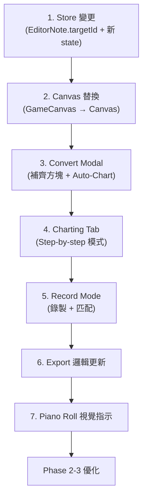

# Level Editor: Canvas 替換 + 譜面製作系統

## 確認事項

- ✅ Auto-Chart + Charting Tab 都做
- ✅ CD 距離以方塊大小（60px）為單位，做為 Convert 的參數
- ✅ 軌道 type 是 `group_rect` 時 targetId 可指向 GroupRect
- ✅ 沒被設定 targetId 的音符不發聲，但保留在 `.yblevel` 中

---

## Phase 1：核心功能

### 1.1 替換 GameCanvas → Canvas

#### [MODIFY] [LevelEditorPage.tsx](file:///e:/phaser_project/ybnote/src/pages/LevelEditorPage.tsx)
- 移除 `GameCanvas` import，改用 `Canvas`
- 移除 `generateMissingBlocks`（不再自動同步）
- 保留 `BlocksPlaybackSync`

---

### 1.2 Store 變更

#### [MODIFY] [useLevelEditorStore.ts](file:///e:/phaser_project/ybnote/src/store/useLevelEditorStore.ts)

```diff
 export interface EditorNote {
   id: string;
   pitch: number;
   name: string;
   timeStart: number;
   duration: number;
   velocity: number;
+  targetId?: string;       // 指向 gameBlock 或 GroupRect 的 ID
+  targetType?: 'block' | 'groupRect';  // 區分目標類型
 }

-activeTab: 'pianoroll' | 'blocks';
+activeTab: 'pianoroll' | 'blocks' | 'charting';

+// Charting Tab state
+chartingNoteIndex: number;
+chartingPaused: boolean;
+chartingAutoSkipAssigned: boolean;

+// Record Mode state
+isRecordingChart: boolean;          // 是否在錄製模式
+recordedChartHits: RecordedHit[];   // 錄製的操作記錄
```

```typescript
interface RecordedHit {
  time: number;        // 以音樂時間為基準（已校正速度）
  blockId: string;     // 觸發的方塊 ID
  blockType: 'block' | 'groupRect';
}
```

---

### 1.3 Toolbar + Convert Modal

#### [MODIFY] [LevelEditorToolbar.tsx](file:///e:/phaser_project/ybnote/src/components/editor/LevelEditorToolbar.tsx)
- Tab 按鈕新增第三個 tab: `Charting`
- 新增 🔄 Convert 按鈕

#### [NEW] `ConvertModal.tsx`

**補齊方塊（Generate Missing Blocks）**
- 掃描 MIDI 中所有 `pitch + instrument` 組合
- 對比現有 `gameBlocks`，只補齊缺少的
- 如果軌道 instrument 是 `group_rect`，則生成 GroupRect 而非 Block

**自動生成譜面（Auto-Chart）**
- 參數面板：
  - `CD 半徑`：預設 2（單位：方塊大小 = 60px），可調
  - `策略`：最近距離 / 輪替 / 隨機
  - `僅處理未分配的音符`：checkbox，預設勾選

**Auto-Chart 演算法（最近距離 + CD）**：
```
lastTriggeredBlock = null
cdMap = {} // blockId → cooldown timestamp

for each note in midiNotes (按時間排序):
  candidates = gameBlocks.filter(pitch === note.pitch && instrument match)
  
  // 過濾 CD 中的方塊
  activeCandidates = candidates.filter(b => cdMap[b.id] == null || note.time > cdMap[b.id])
  if (activeCandidates.length === 0) activeCandidates = candidates  // CD 全滿就重置
  
  // 選最近的
  if (lastTriggeredBlock):
    chosen = activeCandidates.sortBy(distance to lastTriggeredBlock)[0]
  else:
    chosen = activeCandidates[0]
  
  note.targetId = chosen.id
  lastTriggeredBlock = chosen
  
  // 給 CD 半徑內的同音調方塊加 CD
  for each b in candidates:
    if (distance(b, chosen) <= cdRadius * 60):
      cdMap[b.id] = note.time + cdDuration
```

---

### 1.4 Charting Tab（互動式製譜）

#### [NEW] `ChartingTab.tsx`

佈局：
```
┌──────────────────────────────────────┐
│  Canvas（完整的方塊畫布）              │
│  - 匹配音調的方塊高亮閃爍              │
│  - 已分配的方塊顯示序號標記             │
│                                      │
├──────────────────────────────────────┤
│ Mini Timeline                        │
│ ◀ ● ▶  C4 (Piano) @ 2.34s   3/128   │
│ [Auto-skip ✓] [Record ⏺] [Reset]    │
└──────────────────────────────────────┘
```

**Step-by-step 模式**：
1. 音樂播放，遇到未設定的音符 → 暫停，高亮候選方塊
2. 點擊方塊 → 寫入 `targetId` → 繼續播放
3. 已設定的音符 → 觸發方塊閃爍，自動播過
4. 點擊 timeline 上已設定的音符 → 可重新選擇

---

### 1.5 Record Mode（錄製模式）🆕

這是你的新 idea — 直接在畫布上「演奏」來製譜。

#### 運作方式

```
┌──────────────────────────────────────┐
│  Canvas（互動模式，可觸發方塊）        │
│  ⏺ REC   0.5x   00:12.340           │
│                                      │
├──────────────────────────────────────┤
│ ⏺ Recording...  Speed: 0.5x         │
│ [■ Stop & Apply]  [✕ Discard]        │
└──────────────────────────────────────┘
```

**流程**：
1. 在 Charting Tab 按下 ⏺ Record 按鈕
2. 選擇播放速度（0.25x / 0.5x / 0.75x / 1.0x）
3. 音樂開始播放，畫面進入互動模式（類似 play mode，但不鎖定游標）
4. 玩家在畫布上點擊/滑過方塊，每次觸發都記錄 `{ musicTime, blockId }`
5. 按 Stop → 進入匹配階段

**速度校正**：
```typescript
// 錄製時，時間基於實際音樂位置而非 Date.now()
// 這樣不管什麼播放速度，時間都是正確的
const musicTime = playbackPosition; // 已經是 1x 的真實時間
recordedHits.push({ time: musicTime * 1000, blockId, blockType });
```

**匹配演算法**：
```
錄完之後，將 recordedHits 與 midiNotes 配對：

1. 展開所有非 background track 的 notes，按時間排序
2. 對每個 recordedHit：
   a. 找到時間最接近且 pitch 匹配的未分配 note
   b. 如果 |hit.time - note.time| < tolerance（預設 200ms），配對成功
   c. note.targetId = hit.blockId
3. 顯示結果摘要：
   - 成功配對: 87/120 個音符
   - 未配對（漏掉的）: 33 個
   - 多餘的點擊: 5 個
4. 用戶確認 → Apply，或 Discard
```

> [!TIP]
> **為什麼這個方案特別好？**
> - 利用現有的 `recordEvent` / `recordedEvents` 基礎設施
> - 慢速播放讓你不需要技術就能 chart 高難度的曲子
> - 錄完之後還能在 Charting Tab 逐音微調，或再次 Record 覆蓋某一段
> - 可以只錄一段（比如 0:30 ~ 1:00），不需要從頭到尾

**部分錄製**（Range Recording）：
- 可以設定起始時間（從 playbackAnchor 開始）
- 錄製時只匹配時間範圍內的音符
- 已有 targetId 的音符可以選擇「覆蓋」或「跳過」

**匹配結果預覽**：
錄完後不立即 apply，而是先顯示一個預覽：
- 在 Piano Roll 上，成功配對的音符標綠色
- 未配對的音符標紅色
- 多餘的點擊顯示為灰色標記
- 用戶可以在預覽中手動調整，然後一次性 Apply

---

## Phase 2：UX 優化

### 2.1 Piano Roll 視覺指示器

#### [MODIFY] [PianoRoll.tsx](file:///e:/phaser_project/ybnote/src/pages/../components/editor/PianoRoll.tsx)

| 狀態 | 視覺 |
|------|------|
| 有 `targetId` | 音符左側有小圓點（方塊的顏色） |
| 無 `targetId`，有匹配方塊 | 正常顯示 |
| 無 `targetId`，無匹配方塊 | 紅色虛線邊框（會靜音） |
| Background track | 灰色半透明 |

---

### 2.2 方塊使用量熱力圖

在 Blocks 頁面的每個方塊上顯示被指向的次數。

- 0 個 = 暗灰 + ⚠️ 提示
- 1-5 個 = 白色數字
- 6+ 個 = 亮黃色數字
- 幫助平衡難度分佈

---

### 2.3 連線預覽（Connection Preview）

按時間順序，方塊間畫半透明箭頭線，視覺化玩家游標軌跡。

---

### 2.4 難度分析面板

| 指標 | 描述 |
|------|------|
| 平均移動距離 | 相鄰觸發方塊之間的平均 px 距離 |
| 最大移動距離 | 最遠的一次跳躍 |
| Notes/秒 | 音符密度 |
| 未分配音符數 | 還有幾個音沒設定 |

---

## Phase 3：進階功能

### 3.1 批次分配
Piano Roll 選多個同音調音符 → 右鍵 → 「Assign to Block...」 → 點方塊 → 全部分配

### 3.2 段落複製
Copy/Paste targetId 分配（副歌複製用）

### 3.3 拖曳路徑分配
Charting Tab 中拖出路徑，經過的方塊依序分配給連續音符

### 3.4 智慧 CD
根據音符密度動態調整 CD 時間

### 3.5 Charting Tab 快捷鍵

| 快捷鍵 | 功能 |
|--------|------|
| `Space` | 暫停/繼續 |
| `←` / `→` | 上一個/下一個音符 |
| `Backspace` | 清除當前 targetId 並退回 |
| `1-9` | 快速選第 N 個候選方塊 |
| `Tab` | 循環候選方塊 |
| `Enter` | 確認選擇並前進 |

---

## Export 邏輯

#### [MODIFY] [LevelEditorToolbar.tsx](file:///e:/phaser_project/ybnote/src/components/editor/LevelEditorToolbar.tsx)

```typescript
for (const note of track.notes) {
  if (track.isBackground) {
    gameEvents.push({ time, pitch, instrument, blockId: 'background' });
  } else if (note.targetId) {
    gameEvents.push({ time, pitch, instrument, blockId: note.targetId });
  }
  // 沒有 targetId → 不加入 gameEvents（靜音），但保留在 midiNotes
}
```

> [!IMPORTANT]
> `.yblevel` 的 `midiNotes` 保留所有音符（含 targetId），`events` 只包含有 targetId 的。重新匯入時能恢復完整編輯狀態。

---

## 實作順序



## 譜面製作方式總結

用戶現在有 **四種** 方式來製作譜面，從全自動到全手動：

| 方式 | 速度 | 精確度 | 適用場景 |
|------|------|--------|----------|
| **Auto-Chart** | ⚡ 最快 | ⭐⭐ | 快速初始化，密集段落 |
| **Record Mode** | 🔴 較快 | ⭐⭐⭐ | 實際「玩」出譜面，直覺 |
| **Charting Tab** | 🎯 中等 | ⭐⭐⭐⭐ | 逐音精修，精確控制 |
| **Piano Roll 雙擊** | ✏️ 最慢 | ⭐⭐⭐⭐⭐ | 單個音符微調 |

典型工作流：Auto-Chart → Record Mode 修正問題段落 → Charting Tab 精修 → Piano Roll 微調

## Verification Plan

### 手動驗證
1. 匯入 MIDI → Convert → 補齊方塊 → 確認方塊生成
2. Auto-Chart → 確認 CD 輪替效果
3. Charting Tab 互動測試
4. Record Mode：0.5x 速度錄製 → 停止 → 確認匹配結果 → Apply
5. Piano Roll 視覺指示確認
6. Export → Import → 確認 targetId 保留
7. 遊戲中確認只有 targetId 的音符觸發
